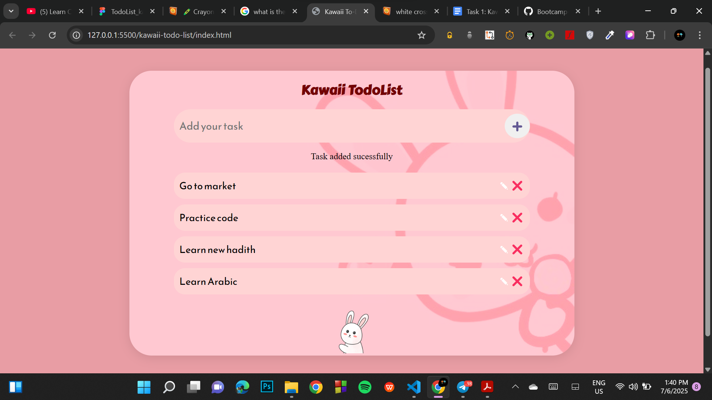
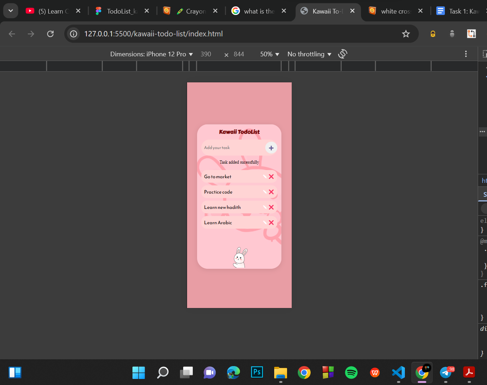

# Kawaii TodoList
This is the first weekly task of html and css learning from ASTUMSJ-SUMMER BOOTCAMP. This project or task was very help full to understand the basics of html and css. 
The task is to make a simple Todo list using only html and css. Plus the todo list has be the same us the the one on the figma https://www.figma.com/design/HPX4YmpYZQ7xIJ5g6GjDRc/TodoList_kawaii--Community-?node-id=0-1&p=f&t=2csIG6ZDHxx9gPrB-0 

# Final output

> ## Desktop or PC view

> ## Mobile view

## My approach
Some part of the task were easy for me for example putting the html elements was easy. The difficult or the challenging part was the styling specially the responsivness of the page.
My approach was I put the main elements first using html and then I started styling them untill I get the output I wanted.  
